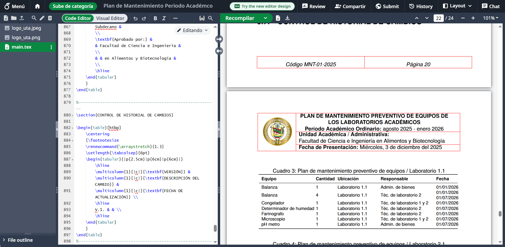
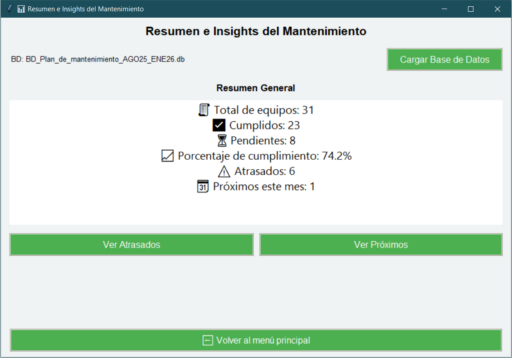
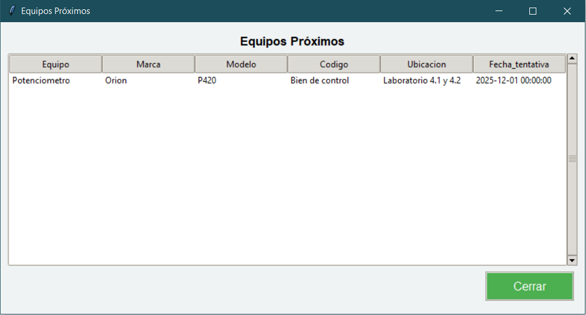

# SAPhyton — Sistema de Asistencia para Mantenimiento Preventivo en Python

SAPhyton es una aplicación de escritorio desarrollada en Python que funciona como un **CMMS liviano** (similar a SAP PM) que permite gestionar:

- Planes de mantenimiento preventivo  
- Registro de cumplimiento  
- Generación de informes LaTeX  
- Resúmenes e insights  
- Todo respaldado en una base **SQLite**  
- Interfaz gráfica completa en **Tkinter**

---

# 1. Características principales

## 1.1. Interfaz Principal


---

## 1.2. Plan de Mantenimiento Preventivo

- Importación de base de equipos desde Excel  
- Normalización automática de columnas  
- Cálculo del estado del equipo (Al día, Próximo, Pendiente)  
- Filtrado por ubicación  
- Asignación de fechas tentativas  
- Guardado en base **SQLite**  

**Vista del módulo:**


---

## 1.3. Gestión de Cumplimiento

- Lectura del plan desde la BD SQLite  
- Marcar mantenimientos realizados  
- Registro automático de fecha de cumplimiento  
- Eliminación de registros seleccionados  

**Vista del plan guardado:**


---

## 1.4. Generación de Informe LaTeX

Se carga una plantilla en LaTex con el formato del documento y en la sección de anexos se genera la información del plan de mantenimiento guardado en la base de datos de manera automática, el presente formato está optimizado para compilarse utilizando pdfLaTex con la ayuda de Overleaf:

- Inserta tablas dinámicas en LaTeX  
- Agrupación por ubicación  
- Uso de `\multirow`, tablas limpias y etiquetas  
- Escapa caracteres especiales  
- Inserción automática de:  
  - Período académico  
  - Fecha de presentación (en español)

**Vista del generador de informes:**




---

## 1.5. Resumen e Insights

- Totales de equipos  
- Porcentaje de cumplimiento  
- Equipos atrasados  
- Próximos a mantenimiento  
- Programa mensual  
- Vistas filtradas detalladas  

**Vista de la ventana de resumenes e insights:**





---

## 1.6. Acerca de

- Detalle de los créditos  

**Vista de la ventana acerca de:**


---

# 2. Arquitectura del Proyecto

```
Tkinter GUI
├── main.py
├── plan_mantenimiento.py
├── cumplimiento.py
├── informe_latex.py
├── resumen_insights.py

Backend / Utils
├── database.py (gestión SQLite)
├── utils.py (config.json)

Datos
├── *.xlsx (archivos de equipos)
├── *.db (bases SQLite)
├── plantilla.tex (plantilla LaTeX)
```

---

# 3. Tecnologías utilizadas

- **Python 3**  
- **Tkinter** — interfaz gráfica  
- **SQLite** — base de datos local  
- **Pandas** — importación y limpieza desde Excel  
- **Pillow** — manejo de imágenes  
- **LaTeX** — informes formales  
- **JSON** — configuración persistente  

---

# 4. Cómo ejecutar la aplicación

## 4.1. Clonar el repositorio:

```
git clone https://github.com/paulomarc49/sapython.git
cd sapython
```

## 4.2. Instalar dependencias:

```
pip install pandas pillow
```

## 4.3. Ejecutar:

```
python main.py
```

# 5. Licencia

MIT License © 2025 Luis Paolo Marcial Sánchez

# 6. Autor

Luis Paolo Marcial Sánchez
Desarrollador Python · Científico de Datos · Analista de Datos · Automatización
GitHub: https://github.com/paulomarc49
