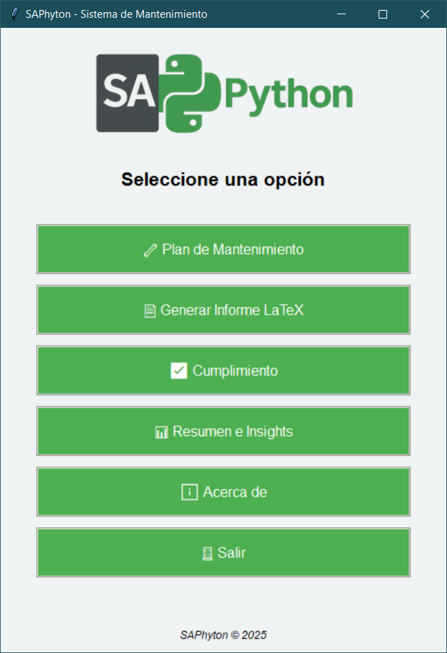
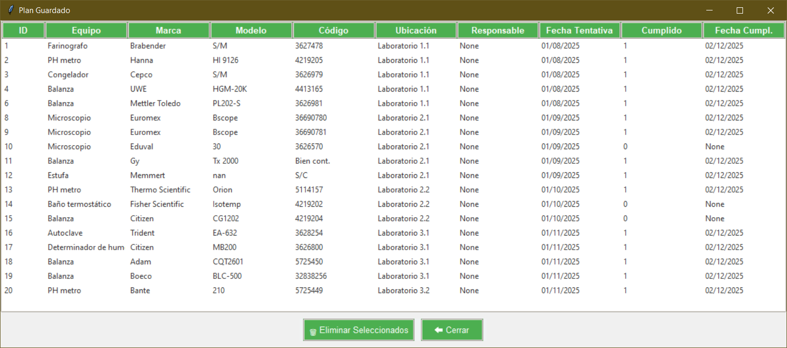
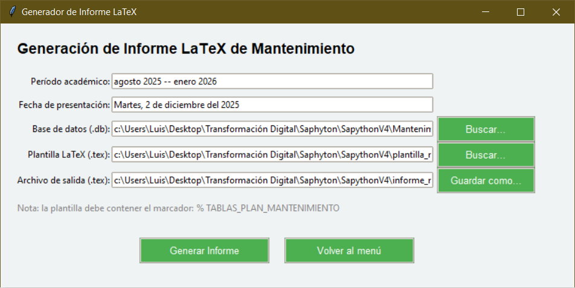

# 🛠 SAPhyton — Sistema de Mantenimiento Preventivo en Python

SAPhyton es una aplicación de escritorio desarrollada en Python que funciona como un **CMMS liviano** (similar a SAP PM).  
Permite gestionar:

- Planes de mantenimiento preventivo  
- Registro de cumplimiento  
- Generación de informes LaTeX  
- Resúmenes e insights  
- Todo respaldado en una base **SQLite**  
- Interfaz gráfica completa en **Tkinter**

---

## 🖥️ Interfaz Principal



---

# 📦 Características principales

## ✔ 1. Plan de Mantenimiento Preventivo

- Importación de base de equipos desde Excel  
- Normalización automática de columnas  
- Cálculo del estado del equipo (Al día, Próximo, Pendiente)  
- Filtrado por ubicación  
- Asignación de fechas tentativas  
- Guardado en base **SQLite**  

**Vista del módulo:**


---

## ✔ 2. Gestión de Cumplimiento

- Lectura del plan desde la BD SQLite  
- Marcar mantenimientos realizados  
- Registro automático de fecha de cumplimiento  
- Eliminación de registros seleccionados  

**Vista del plan guardado:**



---

## ✔ 3. Generación de Informe LaTeX

- Inserta tablas dinámicas en LaTeX  
- Agrupación por ubicación  
- Uso de `\multirow`, tablas limpias y etiquetas  
- Escapa caracteres especiales  
- Inserción automática de:  
  - Período académico  
  - Fecha de presentación (en español)

**Vista del generador de informes:**



---

## ✔ 4. Resumen e Insights

- Totales de equipos  
- Porcentaje de cumplimiento  
- Equipos atrasados  
- Próximos a mantenimiento  
- Programa mensual  
- Vistas filtradas detalladas  

---

# 🧱 Arquitectura del Proyecto

```
Tkinter GUI
├── main.py
├── plan_mantenimiento.py
├── cumplimiento.py
├── informe_latex.py
├── resumen_insights.py

Backend / Utils
├── database.py (gestión SQLite)
├── utils.py (config.json)

Datos
├── *.xlsx (archivos de equipos)
├── *.db (bases SQLite)
├── plantilla.tex (plantilla LaTeX)
```

---

# 🛠 Tecnologías utilizadas

- **Python 3**  
- **Tkinter** — interfaz gráfica  
- **SQLite** — base de datos local  
- **Pandas** — importación y limpieza desde Excel  
- **Pillow** — manejo de imágenes  
- **LaTeX** — informes formales  
- **JSON** — configuración persistente  

---

# ▶️ Cómo ejecutar la aplicación

1. Clonar el repositorio:

```bash
git clone https://github.com/paulomarc49/sapython.git
cd sapython

2. Instalar dependencias:

pip install pandas pillow


3. Ejecutar:

python main.py

📄 Licencia

MIT License © 2025 Luis Paolo Marcial Sánchez

👤 Autor

Luis Paolo Marcial Sánchez
Desarrollador Python · Analista de Datos · Automatización
GitHub: https://github.com/paulomarc49
